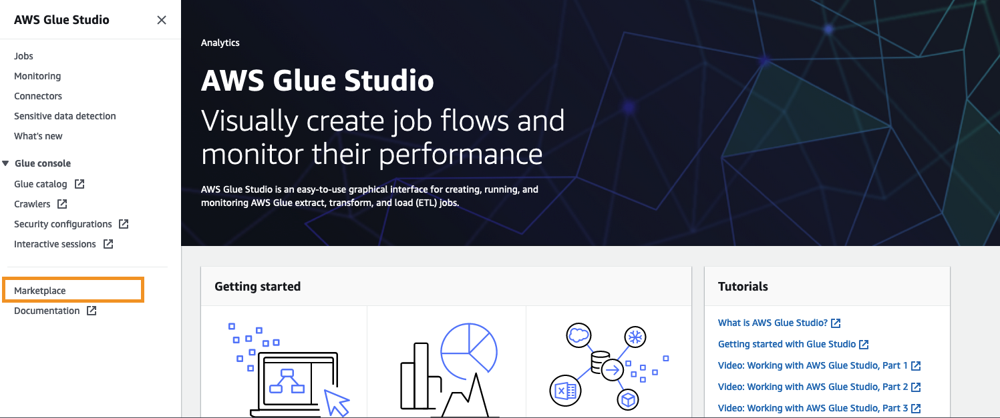
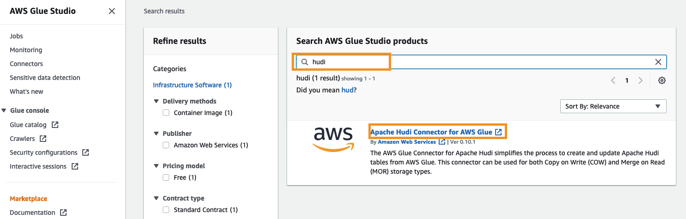
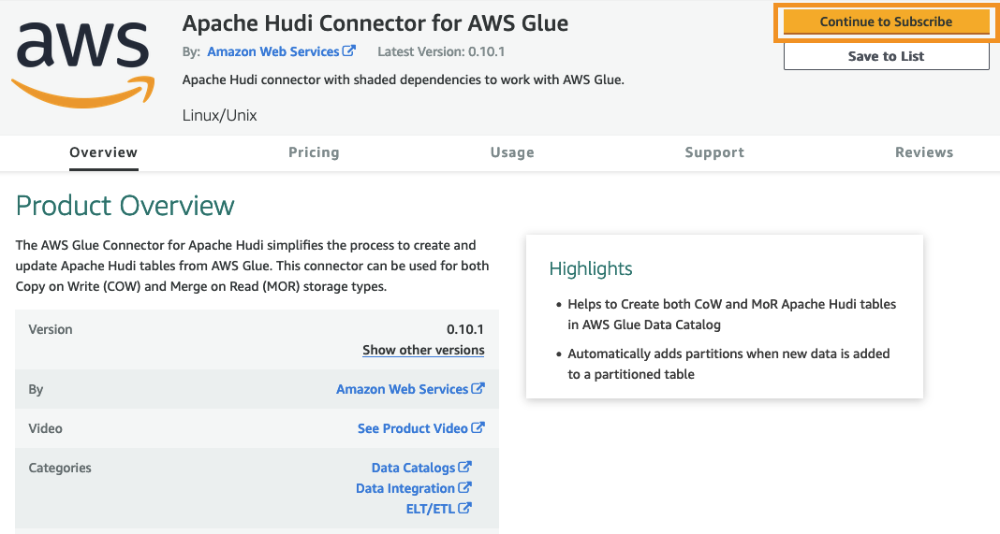
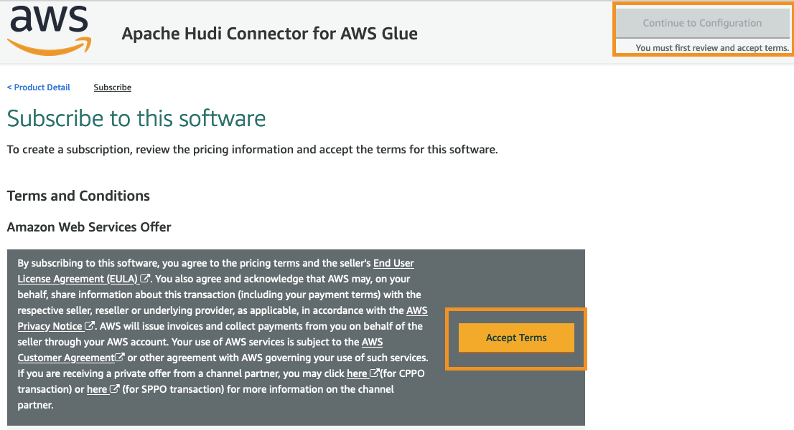
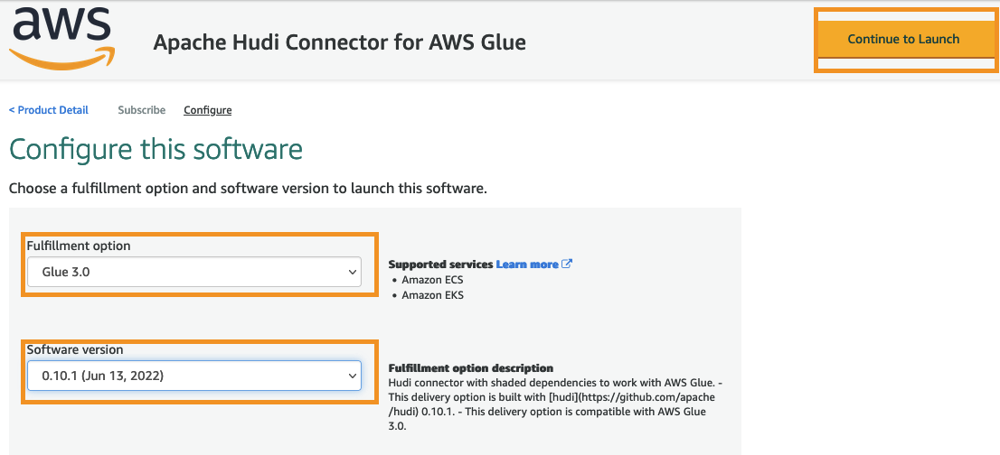
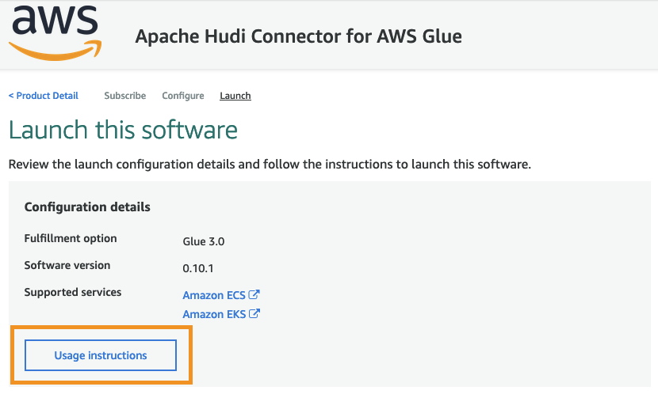
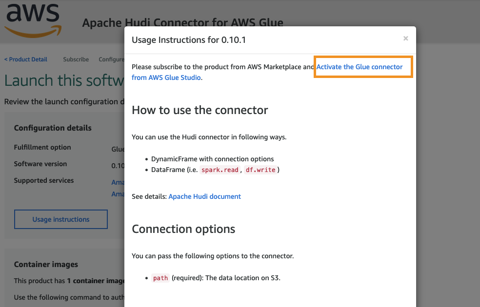
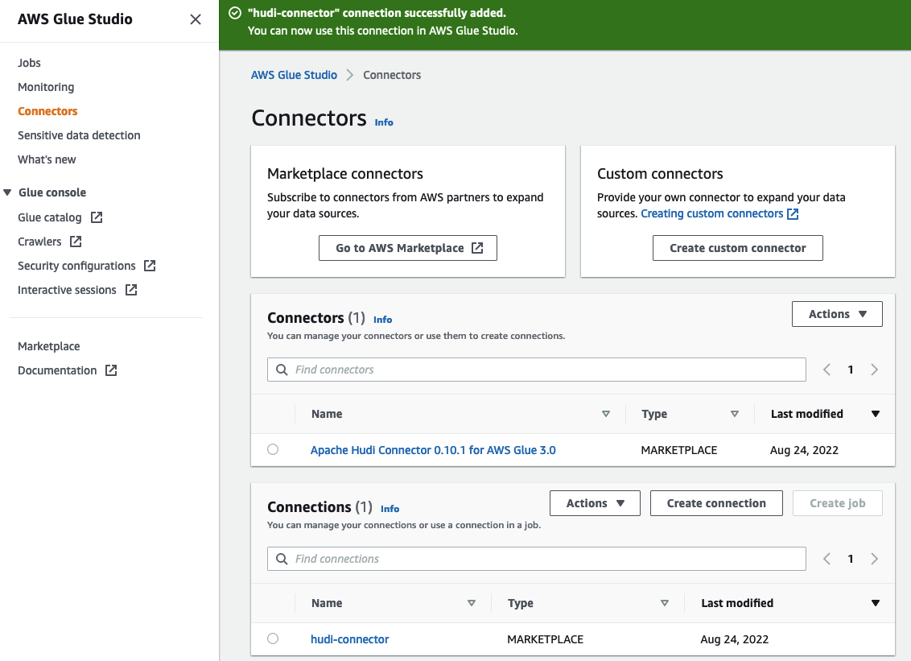

# Low-Code Transactional Data Lake on AWS

## Prerequisite

### Subscribe Apache Hudi Connector for AWS Glue from AWS marketplace

- Navigate to AWS Marketplace from AWS Glue Studio Console

    

- Search Apache Hudi Connector for AWS Glue

    

- Start to subscribe Apache Hudi Connector for AWS Glue

    

- Accept EULA and continue

    

- Configure Glue and Hudi version

    

- Open instruction

    

- Activate the Glue connector from AWS Glue Studio

    

- Setup the connector name to `hudi-connector` and click __Create Connection and activate connector__

    

- Check final result

    

## Deployment

Before starting, make sure your Python verion >= 3.8 and installed [Poetry](https://python-poetry.org/) ([How to install](https://python-poetry.org/docs/#installation))

```bash
git clone https://github.com/gavinjwl/aws-solutions.git

cd lowcode-transactional-datalake

poetry install

source .venv/bin/activate

cdk deploy
```

## Known issues

- Lakeformation integration

    After CDK deployed, you need to grant database/table read/write permissions to Glue role which CDK created
